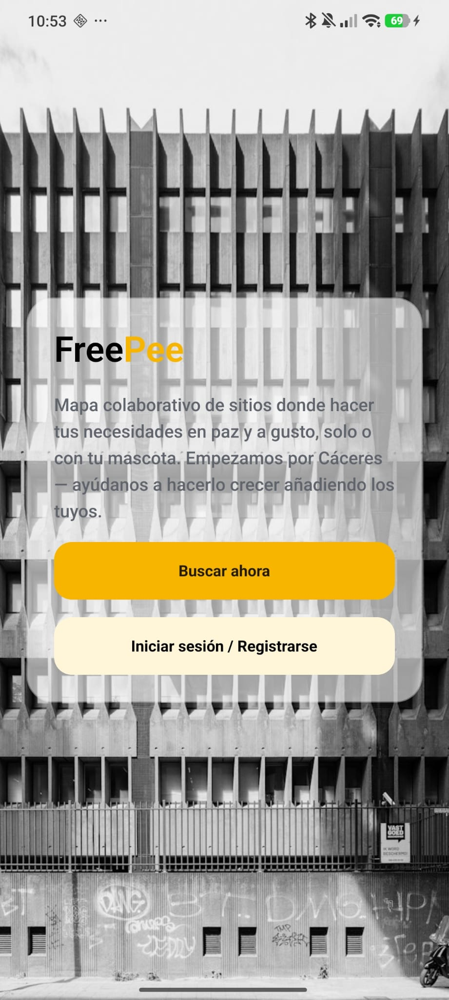
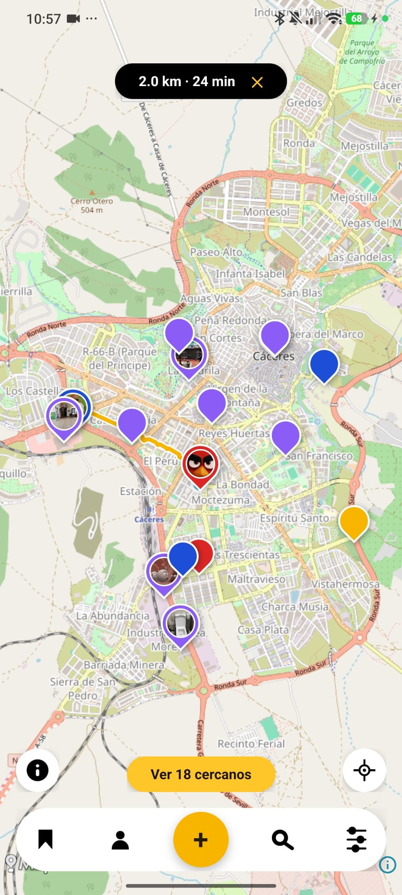

# FreePee

Mapa colaborativo de baños públicos. Crea, encuentra y valora sitios donde
hacer tus necesidades en paz — solo o con tu mascota. Empezando por Cáceres.

> Proyecto en fase de pruebas cerradas con un grupo reducido de usuarios
> reales, todavía sin lanzamiento público.

## Capturas

<p align="center">
  
  
</p>

<p align="center">
  <a href="docs/media/demo.mp4">🎥 Ver vídeo de la demo</a>
</p>

## Qué hace

- **Mapa en tiempo real** con los marcadores de la comunidad (tipo de baño,
  género, precio, horario, accesibilidad en silla de ruedas, foto de
  cabecera).
- **Búsqueda por cercanía** con distancia y tiempo a pie reales (vía
  OpenRouteService), no solo línea recta.
- **Reseñas** por comodidad e higiene, con moderación básica (reportar
  marcador/reseña).
- **Favoritos**, perfil con estadísticas, y gestión de los marcadores
  propios.
- **Cuentas con verificación de email** y varias capas antibots (CAPTCHA,
  rate limiting, límite diario de marcadores, bloqueo de emails
  desechables).

## Stack

| | |
|---|---|
| App móvil | [Expo](https://expo.dev) + Expo Router (React Native, Android — iOS aparcado) |
| Mapas | [MapLibre](https://maplibre.org) + tiles de OpenStreetMap, sin API key |
| Backend | Node.js + [Fastify](https://fastify.dev) |
| Base de datos | PostgreSQL + [PostGIS](https://postgis.net) ([Supabase](https://supabase.com)) vía [Prisma](https://www.prisma.io) |
| Auth | JWT propio, verificación de email (Brevo) |
| Despliegue | Backend en [Railway](https://railway.app), app en [EAS Build](https://expo.dev/eas) |

## Estructura

```
src/app/        pantallas (Expo Router)
src/components/ UI compartida
src/hooks/      lógica de datos y estado compartido
src/constants/  theme, marca
lib/api/        cliente de la API
lib/auth/       sesión (token + contexto)
lib/maps/       abstracción sobre MapLibre
server/         API (Fastify + Prisma)
```

## Desarrollo local

### App

```bash
npm install
npm run dev          # Expo — pulsa 'a' para Android
```

### Backend

```bash
cd server
npm install
npx prisma generate
npm run dev           # Fastify en localhost:3000
```

Variables de entorno necesarias (`server/.env`): `DATABASE_URL`,
`JWT_SECRET`, `JWT_EXPIRES_IN`, `BREVO_API_KEY`, `BREVO_SENDER_EMAIL`,
`TURNSTILE_SECRET_KEY`, `ORS_API_KEY`. En la raíz del proyecto
(`.env`): `EXPO_PUBLIC_TURNSTILE_SITE_KEY`. Ninguna se incluye en el
repo — pide las claves de desarrollo si las necesitas.

```bash
npx prisma studio      # explorador visual de la base de datos
```

## Licencia

Privado — todos los derechos reservados.
